## Modul 5

Screenshot sebelum profiling dengan JMeter GUI
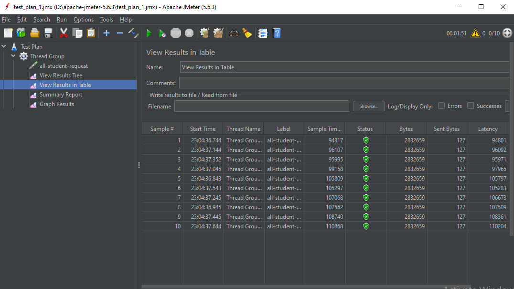
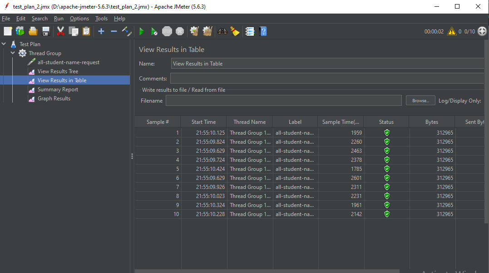
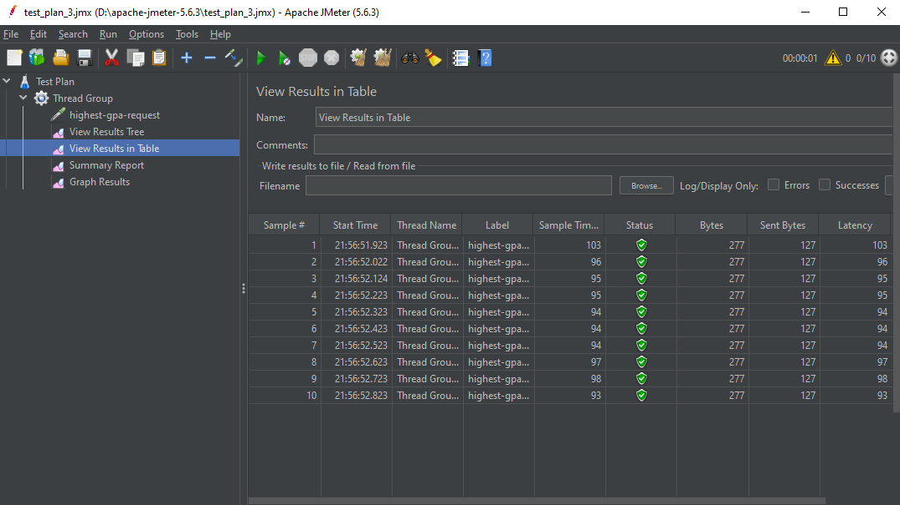

Screenshot sebelum profiling log hasil JMeter CLI
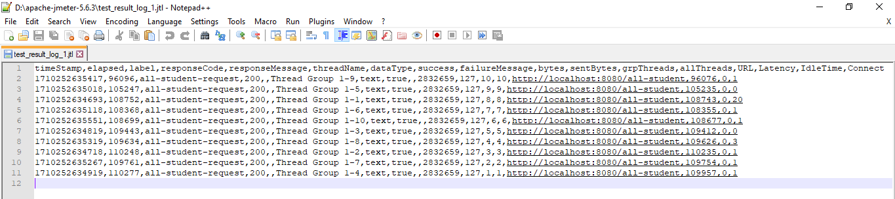
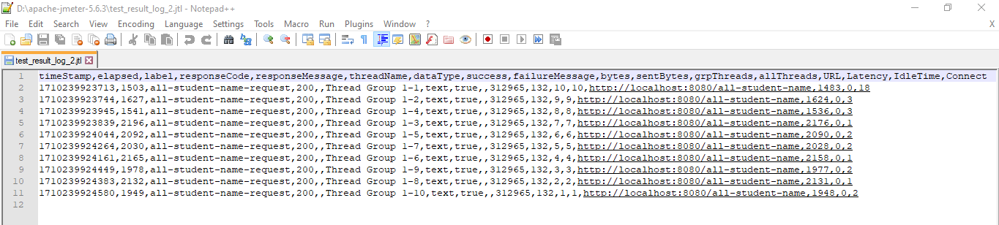
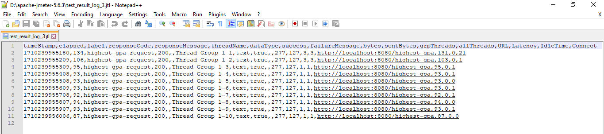

Screenshot sesudah profiling dengan JMeter GUI
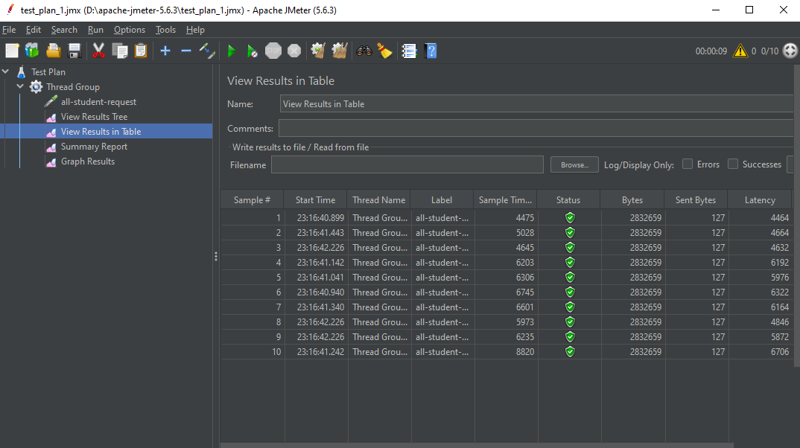
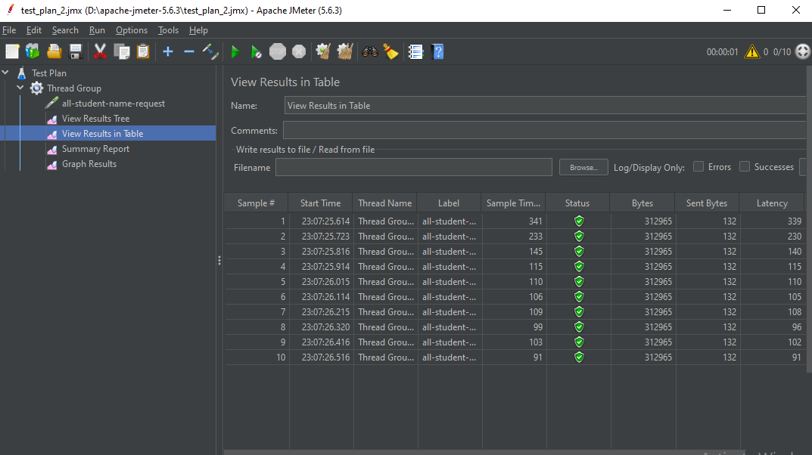
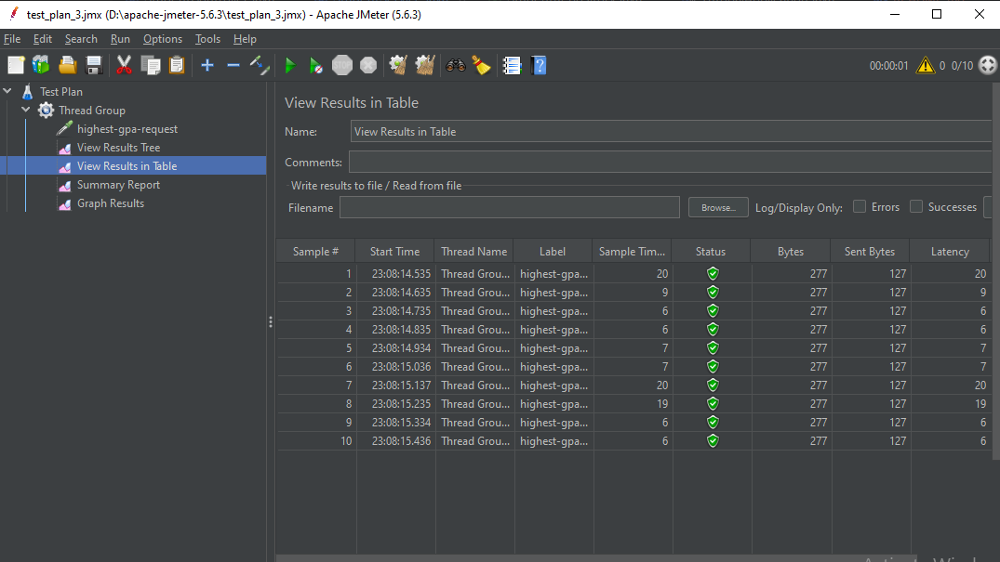

Screenshot sesudah profiling log hasil JMeter CLI
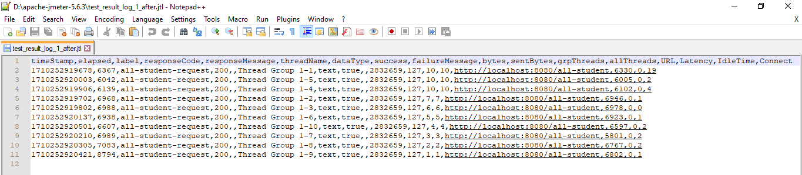
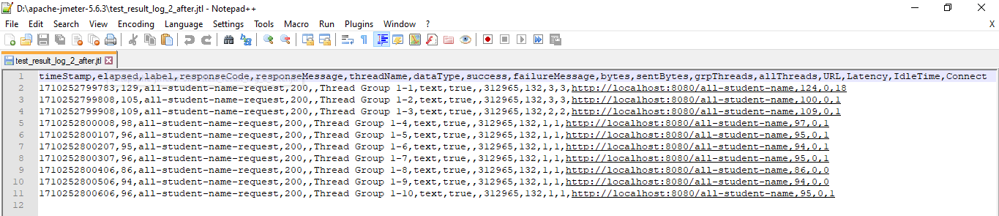
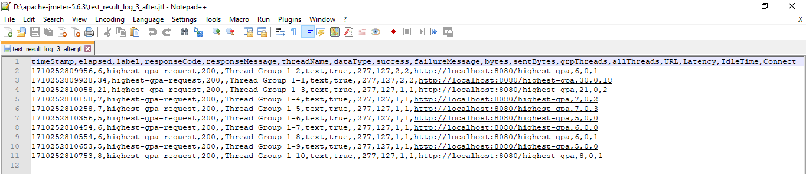

### Konklusi
Dari hasil JMeter sebelum melakukan profiling dan optimisasi, dapat dilihat bahwa waktu yang dibutuhkan untuk melakukan request ke endpoint `all-student` membutuhkan waktu yang sangat lama, sekitar 90k - 110k ms. Waktu yang cukup lama juga dapat dilihat untuk request ke endpoint `all-student-name`, yang berada di kisaran 1700 - 2600ms. Untuk request ke endpoint `highest-gpa` masih cukup wajar, sekitar 90 - 100ms. Namun, setelah melakukan profiling dan optimisasi, waktu yang dibutuhkan untuk melakukan request ke ketiga endpoint di atas menurun dengan cukup banyak, terutama endpoint `all-student` dan `all-student-name`. Waktu yang dibutuhkan untuk melakukan request ke `all-student` turun hingga 4400 - 6700ms dengan salah satu request dari 10 mencapai 8800ms, mendekati hasil awal sebelum profiling dan optimisasi. Untuk request ke endpoint `all-student-name`, waktu yang dibutuhkan turun menjadi sekitar 90 - 100ms, dengan ada 2 request yang mencapai 200 dan 300ms, namun waktu tersebut masih jauh lebih cepat dibanding waktu awal. Untuk request ke endpoint `highest-gpa`, waktu turun menjadi sekitar 6 - 20ms, peningkatan yang bagus juga jika dibandingkan dengan performa awal. Dapat dilihat bahwa dengan melakukan profiling dan meningkatkan performa code dengan optimisasi, waktu yang dibutuhkan untuk menjalankan code tersebut juga dapat mengalami penurunan yang drastis, yang mengakibatkan code kita berjalan dengan lebih cepat.

## Refleksi
> What is the difference between the approach of performance testing with JMeter and profiling with IntelliJ Profiler in the context of optimizing application performance?

Melalui testing performance dengan JMeter, kita tidak mengetahui bagaimana code sebenarnya menghandle request yang kita kirimkan. Kita hanya mengetahui lama tidaknya waktu yang dibutuhkan untuk mendapatkan response. Di lain sisi, dengan menggunakan IntelliJ Profiler, kita dapat mengetahui bagian code mana yang membuat response yang diberikan lama. Dengan IntelliJ Profiler, kita dapat dengan mudah mengetahui bagian code apa yang harus di ubah atau optimisasi agar code kita tidak berjalan terlalu lama. 

> How does the profiling process help you in identifying and understanding the weak points in your application?

Proses profiling membantu saya dalam mengidentifikasi bagian code apa yang kira-kira membuat aplikasi saya berjalan lambat. Saya tidak harus mencari-cari sendiri dan bisa menjalankan semua code saja untuk melihat bagian code apa yang memperlambat aplikasi saya. Ini akan menyelamatkan saya waktu yang cukup signifikan dibanding mengetes setiap code satu per satu.

> Do you think IntelliJ Profiler is effective in assisting you to analyze and identify bottlenecks in your application code?

Menurut saya IntelliJ Profiler cukup efektif dalam membantu saya menganalisis dan mengidentifikasi bottleneck yang ada pada code aplikasi saya. Ini dapat dilihat ketika menjalankan aplikasi sambil melakukan profiling lalu mengirimkan request ke endpoint `all-student`. Setelah response diberikan dari aplikasi saya, saya memberhentikan proses profiling dan dapat dengan mudah melihat kenapa kira-kira aplikasi saya membutuhkan waktu yang lama untuk mengirimkan response. Pada IDE IntelliJ juga ditandai method yang berjalan lama tersebut ketika di klik pada hasil profiling dan didapatkan waktu yang dibutuhkan untuk mengeksekusi code tersebut secara keseluruhan dalam ms.

> What are the main challenges you face when conducting performance testing and profiling, and how do you overcome these challenges?

Tantangan utama yang saya hadapi adalah mengoptimisasi code yang berjalan terlalu lama berdasarkan hasil performance testing dan profiling. Cara saya menghadapi tantangan tersebut adalah dengan mencari-cari apakah ada cara lain untuk melakukan optimisasi, seperti pada method findStudentWithHighestGpa yang pada awalnya saya bingung bagaimana mengoptimisasinya karena terlihat tidak ada cara lain selain melakukan for loop. Namun, ternyata optimisasi bisa dilakukan pada level query dengan mengurutkan hasil query berdasarkan gpa dari yang tertinggi hingga terendah dan hanya mengambil tuple yang paling pertama.

> What are the main benefits you gain from using IntelliJ Profiler for profiling your application code?

Keuntungan utama yang saya dapatkan dengan menggunakan IntelliJ Profiler untuk melakukan profiling pada code aplikasi saya adalah integrasinya dengan IDE yang membuat saya tidak perlu membuka aplikasi-aplikasi lain (selain web browser atau alat untuk mengirimkan request seperti postman dalam kasus ini). Semua kegiatan profiling dapat saya lakukan di satu aplikasi yang menurut saya dapat meningkatkan produktivitas karena tidak harus berpindah-pindah aplikasi. Keuntungan lainnya adalah kemudahan dalam menggunakan IntelliJ Profiler, dimana kita hanya perlu menekan suatu tombol dan profiler akan berjalan tanpa harus setup hal-hal lain.

> How do you handle situations where the results from profiling with IntelliJ Profiler are not entirely consistent with findings from performance testing using JMeter?

Saya mengatasi situasi tersebut dengan mempertimbangkan variasi yang dapat terjadi saat melakukan profiling. Saya akan mencoba melakukan profiling beberapa kali dan melihat apakah perbedaan hasil tersebut konsisten atau perbedaan hasil tersebut hanyalah suatu kejadian suatu waktu. Jika memang setelah beberapa kali profiling hasilnya tetap berbeda, maka ada hal lain yang menyebabkan perbedaan hasil tersebut, seperti cara kerja dari JMeter dan IntelliJ Profiler, yang tidak bisa sepenuhnya di kontrol.

> What strategies do you implement in optimizing application code after analyzing results from performance testing and profiling? How do you ensure the changes you make do not affect the application's functionality?

Strategi yang saya gunakan adalah mencari cara alternatif untuk melakukan apa yang code saya lakukan sebelumnya. Saya melakukan hal tersebut karena jika terdapat cara alternatif untuk melakukan apa yang code saya lakukan sebelumnya, maka apa yang dihasilkan code tersebut seharusnya tidak berubah, sehingga fungsionalitas aplikasi saya seharusnya tidak terdampak buruk oleh perubahan tersebut. Contohnya adalah pada saat saya melakukan optimisasi untuk method joinStudentNames, saya mengubah tipe variable `result` dari `String` menjadi `StringBuilder` karena pada akhirnya `StringBuilder` dapat saya ubah menjadi `String` dengan mudah dan tanpa harus mengubah bagian-bagian lain dari code.
